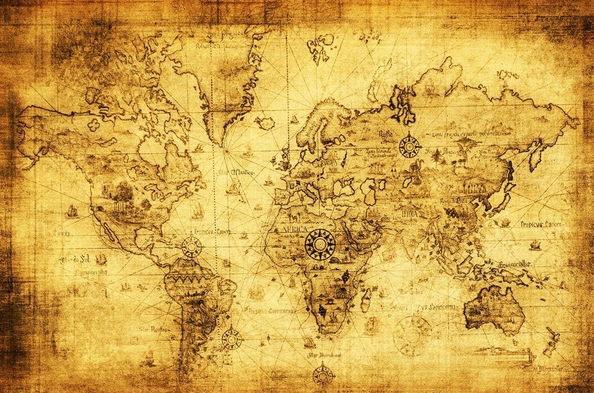

``.. figure::`` 用于生成图例对象。图例是一个包含说明, 图像, 和任意其他文档元素的集合。

   This is the caption of the figure (a simple paragraph).

   The legend consists of all elements after the caption.  In this
   case, the legend consists of this paragraph and the following
   table:

   +-----------------------+-----------------------+
   | Symbol                | Meaning               |
   +=======================+=======================+
   | .. image:: tree.png   | Tree                  |
   +-----------------------+-----------------------+
   | .. image:: wave.png   | River                 |
   +-----------------------+-----------------------+
   | .. image:: peak.png   | Mountain              |
   +-----------------------+-----------------------+